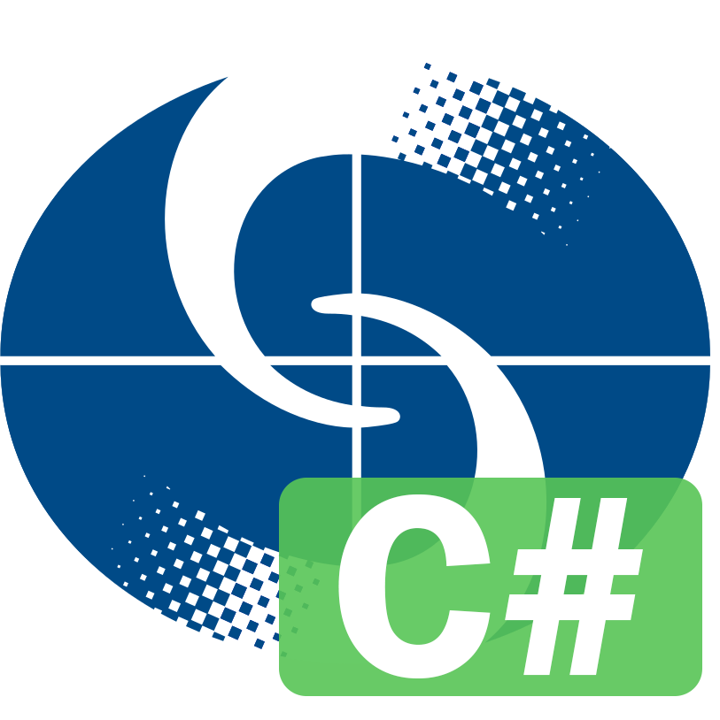

<p align="center">
<br>
<strong>LibHKOSharp</strong><br>
An unofficial C# Library of Hong Kong Observatory Open Data API
</p>

# What is LibHKOSharp?

LibHKOSharp is a C# library which allows you to access the Hong Kong Observatory Open Data API without handling bunches of Http requests, responses or JSON.

# ToDo list

1. ‼️ Rebuild all code with .NET Standard.

# Build

To build the project, you need to:

1. Clone the repo to your machine.
2. Open the `.sln` file with your favourite IDE.
3. That's it!

# Installation

To use LibHKOSharp in your project, there are several ways to do so:

* Build the project and import the `.dll` files manually;
* Download `.dll` files from [Releases](/releases) page and import manually;
* ~~Download from NuGet Package Manager~~ (WORKING IN PROGRESS);

# Usage

For the full usage of LibHKOSharp, you should read [documents page](https://hkosharp.shingzh.eu.org).

Here are some examples of usages of LibHKOSharp:

```c#
// Gets today's Local Weather Forecast
var localForecast = LibHKOSharp.Weather.GetLocalForecast(Language.English);
Console.Write("Description of today's forecast: ");
Console.Write(localForecast.ForecastDesc);
// Output:
// Description of today's forecast: Under the influence of an anticyclone aloft, the weather is ... (omited)
```

```c#
// Gets latest Earthquake information
var eqInfo = LibHKOSharp.Earthquake.GetLatestEqInfoAsnyc(Language.TraditionalChinese);
Console.Write("Latest Earthquake Report Region: ");
Console.Write(eqInfo.Region);
// Output:
// Latest Earthquake Report Region: 班達海
```

# Dependencies

This library uses the following libraries:

* [Newtonsoft.Json](https://github.com/JamesNK/Newtonsoft.Json)

# Prerequisites

* .NET Framework 4.5 or above
